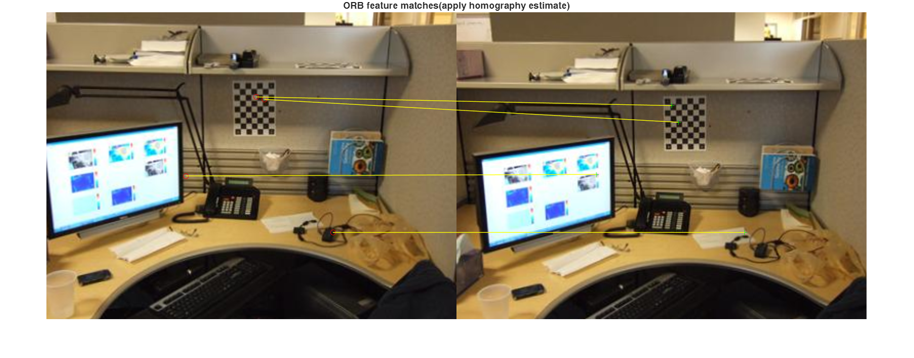
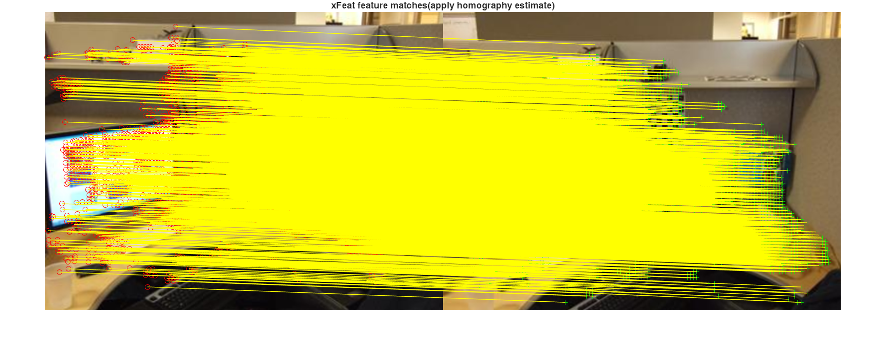

# Pretrained  XFeat(Accelerated Features for Lightweight Image Matching) MATLAB Model

使用导入的ONNX模型，对任意相同大小分辨率的图像进行半稠密匹配推理（semi-dense matching），这是一种较为前沿的端到端直接匹配方法[^1]。该方法广泛应用于多个领域，包括增强现实、三维重建与建图、全景拼接、图像检索以及医学影像分析等。

## Requirements

- MATLAB (test in R2024b)
- [Deep Learning Toolbox™ Converter for ONNX Model Format](https://www.mathworks.com/matlabcentral/fileexchange/67296-deep-learning-toolbox-converter-for-onnx-model-format)

## Example

本示例展示了传统的“orb”,"sift","harris"手工特征检测算子与目前较前沿的深度学习“XFeat”算子对2幅图像进行检测匹配的比较的结果。

```matlab
imgColor1 = imresize(imread("viprectification_deskLeft.png"),2);
imgColor2 = imresize(imread("viprectification_deskRight.png"),2);

% imgColor1 = imread("https://raw.githubusercontent.com/cuixing158/multiBandBlender/main/data/medium16.JPG");
% imgColor2 = imread("https://raw.githubusercontent.com/cuixing158/multiBandBlender/main/data/medium17.JPG");

gray1 = im2gray(imgColor1);
gray2 = im2gray(imgColor2);

%% traditional feature match
t1 = tic;
[matchedPoints1,matchedPoints2] = detectAndMatchPoints(gray1,gray2,"orb"); % or use "sift" ,"harris"
t = toc(t1);
matchWithHomographyAndShow(matchedPoints1,matchedPoints2,t,imgColor1,imgColor2);
```

```matlabTextOutput
inliers:4/9,elapsed time:0.10
```

```matlab
title("ORB feature matches(apply homography estimate)");
```



```matlab
%% xfeat semiDense match
t1 = tic;
[matchedPoints1,matchedPoints2] = xfeatSemiDenseMatch(imgColor1,imgColor2,"params.mat");
t = toc(t1);
matchWithHomographyAndShow(matchedPoints1,matchedPoints2,t,imgColor1,imgColor2);
```

```matlabTextOutput
inliers:3091/3690,elapsed time:0.91
```

```matlab
title("xFeat feature matches(apply homography estimate)");
```



## Support Function

```matlab
function matchWithHomographyAndShow(matchedPoints1,matchedPoints2,t,img1,img2)
[~,inlierIndexs] =estgeotform2d(matchedPoints1,matchedPoints2,"projective",MaxNumTrials=1000,Confidence=0.999,MaxDistance=3.5);
matchedPts1 = matchedPoints1(inlierIndexs,:);
matchedPts2 = matchedPoints2(inlierIndexs,:);

fprintf("inliers:%d/%d,elapsed time:%.2f\n",sum(inlierIndexs),length(inlierIndexs),t)
figure;
showMatchedFeatures(img1,img2,matchedPts1,matchedPts2,"montage")
end

```

## Reference

[^1]: Guilherme Potje, Felipe Cadar, Andre Araujo, Renato Martins, Erickson R. Nascimento`,XFeat: Accelerated Features for Lightweight Image Matching,2024,10.1109/CVPR52733.2024.00259`
